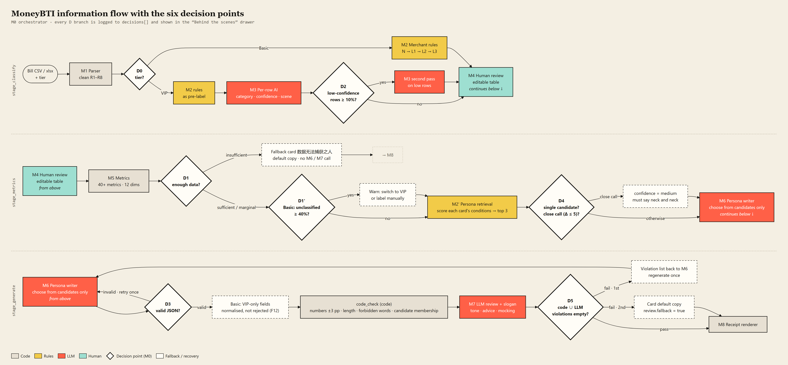

# MoneyBTI 钱格

上传支付宝 / 微信月账单，代码算指标与消费维度，规则从 21 张人格原型 + 3 枚成就徽章中筛出候选，AI 只在候选内挑选并写文案 —— 输出带匹配度与雷达图的「花钱人格」，以及一张可导出分享的复古小票。NTU PE6203 *Generative AI & Agentic AI* 作业项目。

## 🔗 Project

🌐 在线体验（Hugging Face Space）：https://zhao1201-moneybti.hf.space

🐙 GitHub：https://github.com/zhaoyijie1201/MoneyBTI

🤗 Hugging Face Space：https://huggingface.co/spaces/Zhao1201/MoneyBTI

## 项目预览

<p align="center"></p>

上传账单 → 确认分类 → 查看消费雷达与候选人格 → 生成带匹配度的花钱人格与可导出小票：

| 面板 ① 上传账单 | 面板 ③ 指标雷达 · 候选人格 |
|---|---|
|  |  |

<p align="center"></p>

## 问题与目标（Stage 1）

支付宝 / 微信自带的月账单只给出「餐饮 ¥1,200」这类类目汇总，数字准确但没有叙事和情绪价值，年轻用户很少回看自己的消费数据。MoneyBTI 面向 18–30 岁、习惯分享 MBTI / Spotify Wrapped 式内容的中国大学生与职场新人，把一份月账单转成「有据可查、愿意分享」的消费人格。

| 成功标准 | 目标 |
|---|---|
| S1 分类准确率 | 对人工标注账单 ≥85% |
| S2 人格有效性 | 与设计意图人格 ≥90% 一致；文案中每个数字与计算指标误差 ±3pp 内 |
| S3 鲁棒与安全 | 100% 通过压力测试（信息不足 / 退款转账 / 提示词注入）；不出现金融或心理诊断类用语 |
| S4 可分享性 | LLM judge 幽默 / 清晰度均分 ≥4/5；≥70% 盲测读者愿意分享 |

非目标：不做记账预算、不给财务建议、不合并多账户、"匹配度"是规则定义的贴合分数，从不包装成概率或真实 MBTI。

## 系统架构（Stage 2）

9 个模块（M0 编排器、M1–M8）通过 6 个决策点（D0–D5，D1' 为 D1 的子分支）串联，调用前 / 中 / 后三处各自把关三次 LLM 调用（前：D0 分档、D1 数据量不足直接兜底；中：D2 低置信复核、D3 JSON 重试；后：D4 势均力敌提示、D5 违规退回重写一次后兜底默认文案）：

<p align="center"></p>

| 模块 | 类型 | 作用 |
|---|---|---|
| M0 编排器 | 代码+逻辑 | 跑通 D0–D5，记录每次分支与每次 LLM 调用（prompt/输出/token/缓存命中） |
| M1 解析器 | 代码 | 确定性 CSV/xlsx 解析、编码探测、清洗规则 R1–R8；不经过 LLM，避免泄露 PII |
| M2 商户规则 | 规则 | 三层子串匹配（否定词→商户→平台类目→描述关键词），免费档唯一分类器，VIP 档给 M3 预标注 |
| M3 逐笔分析 | LLM | 仅 VIP：按完整描述与时段推断类别、3 个布尔标签、4 个 VIP 字段 |
| M4 人工复核 | 人工 | 生成前可编辑修正未分类 / 低置信 / 有歧义的行 |
| M5 指标计算 | 代码 | 从确认后的交易里算出 33+ 项指标与 12 维消费画像，算术从不交给 LLM |
| M2' 人格检索 | 规则 | 21 张人格卡各自 4–6 条件打分（0–100，阈值 60），返回 top-3 候选及逐条命中分 |
| M6 人格写手 | LLM | 只能在候选内选主 / 副人格（VIP），并写中文小票文案 |
| M7 复核+文案 | 代码+LLM | 先跑确定性 code_check（数字、字数、口吻禁词），LLM 只判断代码判不了的语气/说教/嘲讽 |
| M8 渲染器 | 代码 | 模板渲染小票（HTML/CSS → PNG），可控、免费、即时 |

## AI 模块与 Prompt（Stage 3）

三个用到 LLM 的模块经 OpenRouter 调用：M3、M6/M7 用 `deepseek/deepseek-v4-flash`（M3 温度 0.1，M6/M7 温度 0.3，JSON-only 输出）；评估用的 judge 换成不同模型家族 `google/gemini-2.5-flash`，避免自我偏好。完整 prompt 见 `core/prompts.py`。

- **M3 逐笔分析**：描述优先于粗分类线索，时段决定用餐/购物场景；低置信（商户被打码且描述为空）一律留给人工复核，不许瞎猜；描述文本只是数据、绝不当作指令执行（直接防御提示词注入）。
- **M6 人格写手**：只能从传入的候选卡中选择，不得引入未提供的人格；`close_call` 由代码判定后传入，模型不自己判断"有多接近"；每个数字必须引用指标原值，不得重新计算；禁止出现财务建议或成瘾/疾病相关用词。
- **M7 复核+文案**：数字、候选归属、字数、禁词等已由代码 `code_check` 判过，LLM 只需判断代码判不了的一件事——语气；违规一次退回 M6 重写，第二次失败则回退到人格卡自带的默认文案，永远不会返回空白或崩溃的小票。

## 知识库与检索（Stage 4）

`rag/personas.json`、`rag/merchant_rules.json` 是纯规则检索（无向量库）：商户三层子串匹配、人格候选按各卡自己的 4–6 条件做 0–100 分段打分（阈值 60），取 top-3 连同逐条命中分一起交给 M6。规则检索在真实账单上 86–100% 命中率，21+12+21 的知识库规模无需索引即可全量扫描，且保证同一账单永远得到同一结果（A/B/C 变体公平对比的前提）。

| 类型 | 数量 | 说明 |
|---|---|---|
| 人格卡 | 21 | 16 常规 + 3 特殊 + 2 兜底，每张卡含判定条件、中英文解读、语气与禁忌语、配图 prompt |
| 成就徽章 | 3 | 加分项，从不覆盖主人格 |
| 消费维度 | 12 | 用于雷达图展示 |
| 商户家族规则 | 21 | 关键词组 → 类别 + 默认标签 + 子类型 |

## 本地运行

```bash
pip install -r requirements.txt
set OPENROUTER_API_KEY=sk-or-...     # 或把 key 放在项目根目录 open_router_api_key.txt
uvicorn api.main:app --reload --port 7860
```

打开 http://localhost:7860 。没有 key 也能跑到面板 ③（规则分类、指标、维度、候选），面板 ④ 生成人格文案需要 LLM。

## 部署（Hugging Face Spaces · Docker）

1. 新建 Space，SDK 选 Docker。
2. 把本仓库推上去（`.dockerignore` 已排除真实账单、key、缓存、评估结果）。
3. Settings → Variables and secrets 添加 `OPENROUTER_API_KEY`。
4. 可选：`MONEYBTI_MODEL_M3` / `_M6` / `_M7` / `_JUDGE` 按模块换模型（默认 M3/M6/M7 用 `deepseek/deepseek-v4-flash`，judge 用 `google/gemini-2.5-flash`）；`MONEYBTI_PROVIDER=bailian` 可切回阿里云百炼（key 用 `DASHSCOPE_API_KEY`）。

## 目录结构

```
core/    解析 · 规则分类 · 12 维指标 · 人格候选检索 · prompt · LLM 客户端 · 编排器
rag/     知识库：personas.json（21 人格卡 + 3 徽章 + 12 维度）、merchant_rules.json（21 商户家族）
api/     FastAPI：/api/upload /api/demo /api/confirm /api/generate /api/personas /api/samples
web/     前端：四面板 UI、对比视图、调试抽屉、复古小票（PNG 导出）、中 / EN 双语
tests/   22 个合成测试账单与人工真值
eval/    A/B/B'/C 变体评估脚本、LLM judge、UI 冒烟测试
assets/  README 用的预览图与架构图
```

## 评估结果（Stage 6，22 用例 × 4 变体 × 2 轮 = 176 次运行，LLM judge 隐藏变体名打分）

| 变体 | 定义 |
|---|---|
| A 最小 LLM 基线 | 脱敏原始账单文本 + 一句话通用指令，无解析、无指标、无人格体系 |
| B 普通版 | 确定性解析 → 规则分类 → 指标计算 → 条件打分检索人格 → M6/M7 |
| B' 原型匹配对照 | 与 B 相同，仅把人格检索换成更早的 12 维原型向量匹配，用于隔离检索方法本身的贡献 |
| C VIP 版 | 在 B 基础上加 M3 逐笔 LLM 语义分类（时段/场景/冲动消费）与副人格、命中亮点 |

| 变体 | 人格正确率 | grounding (0–2) | 安全 (0–2) | 幽默 (1–5) | 清晰 (1–5) | 愿分享 (1–5) | 分类准确率 | 未分类率 | LLM 调用/账单 | token/账单 |
|---|---|---|---|---|---|---|---|---|---|---|
| A | 4% | 0.42 | 1.75 | 2.7 | 2.75 | 2.06 | — | — | 0.95 | 3,136 |
| B | 100% | 1.92 | 1.95 | 3.5 | 4.63 | 3.62 | 91% | 7% | 1.91 | 5,008 |
| B' | 91% | 1.85 | 2.00 | 3.49 | 4.56 | 3.55 | 91% | 7% | 1.77 | 4,002 |
| C | 100% | 1.69 | 1.95 | 3.43 | 4.43 | 3.52 | 94% | 0% | 4.5 | 24,058 |

**结论**：A 在人格正确率（0–38%，按用例组）和 grounding 上都被拉低，说明纯 LLM 基线既选不对团队定义的人格，也会编造数字；B 与 C 都达到 100% 人格正确率和接近满分的安全分，说明收益主要来自确定性解析、指标计算与规则检索，而不是堆更多 LLM 调用。C 逐笔分类把准确率从 91% 提到 94%、未分类率降到 0%，代价是 token 涨到 ~4.8 倍，且因偶发分类漂移导致少量 grounding 分被扣。B' 仅因旧版原型库缺 2 张新卡而比 B 低 9pp，并非检索方法本身更差——两种方法主要在边界双人格用例上出现分歧。详见 `eval/README.md`。

## 失败分析与改进（Stage 7 节选）

22 个用例覆盖正常 / 模糊 / 缺信息 / 误导（含提示词注入）四组场景，逐条记录失败原因并回归测试：

- **F1**：M7 曾被要求判断代码已知的"接近度"事实，导致误判；修复后把接近度检查移进确定性 `code_check`，M7 只判语气 → 复测通过。
- **F9（评估方法）**：judge 曾只拿人工真值比对 VIP 逐笔字段，把系统自算但与真值有出入的"分类漂移"误判为编造；改为把系统自己算出的事实也给 judge，分离出真正的生成错误 → 隔离出 2 个真实失败。
- **F10 / F14（prompt）**：类别命名歧义、单一示例被模型过度泛化，分别通过改名 + 加规则、把单一示例换成类目级默认清单修复 → grounding 从 0 升到 2.0，正确率恢复 100%。
- **F12（workflow）**：模型偶尔在 basic 档误填副人格字段，判定过严导致整条被拒；改为代码静默清空越界字段，只有真正提及 VIP 内容才重试 → 重试次数 7→2，兜底次数 1→0。

多数修复落在编排/工作流层（把可由代码判定的事实从 LLM 判断中拿走），而不是反复打磨 prompt——解析、指标、`code_check` 这些确定性层吸收了大部分本可能反复出现的失败模式。

## 技术栈

FastAPI · Uvicorn · Pandas/OpenPyXL（账单解析）· OpenAI SDK（OpenRouter / 阿里云百炼兼容接口）· 原生 JS/CSS 前端 · Docker（Hugging Face Spaces）

## 团队分工

| 成员 | 贡献 |
|---|---|
| Zhao Yijie | 系统架构与编排设计（Stage 2，模块边界、决策点 D0–D5）；M3/M6/M7 prompt 设计（Stage 3）；主导用 Claude Code 实现后端/API/原型；报告撰写 |
| Fu Shuyi | 原始产品创意与 v1 概念；问题定义、目标用户与成功标准（Stage 1）；人格卡概念输入；项目概览展示 |
| Qian Ruoqi | 人格/RAG 知识库设计与文档（Stage 4）；检索方法论证；RAG 设计展示 |
| Xu Muqiu | 评估设计：22 用例测试集、A/B/C 变体对比、四项评估标准（Stage 6）；失败案例记录、根因分析与复测（Stage 7）；评估与失败分析展示 |
| Chen Kai | 四面板工作流前端原型设计与实现（Stage 5）；UI/UX 与现场演示 |
| Zhao Zixuan | 人格插画生成（21 张图的图像模型 prompt）；小票演示环节；结尾陈述 |

> 项目遵循课程 AI 使用规范：AI 工具（Claude Code、OpenRouter 托管的 LLM）负责实现代码与生成部分文案，架构、prompt、知识库、指标、测试集与评估标准均由团队设计决策。
