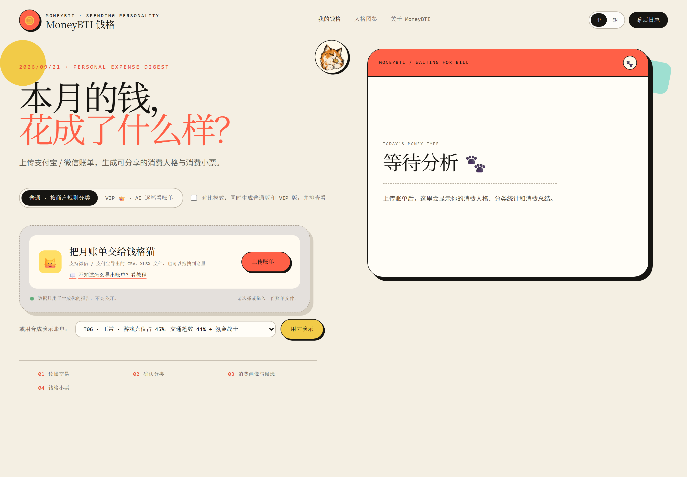
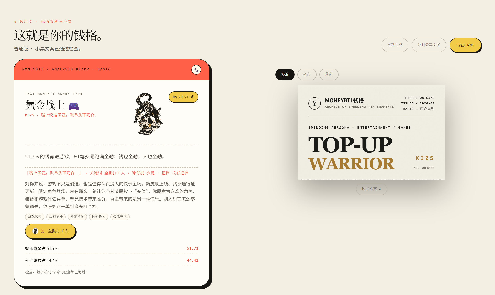
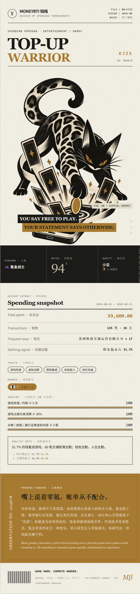
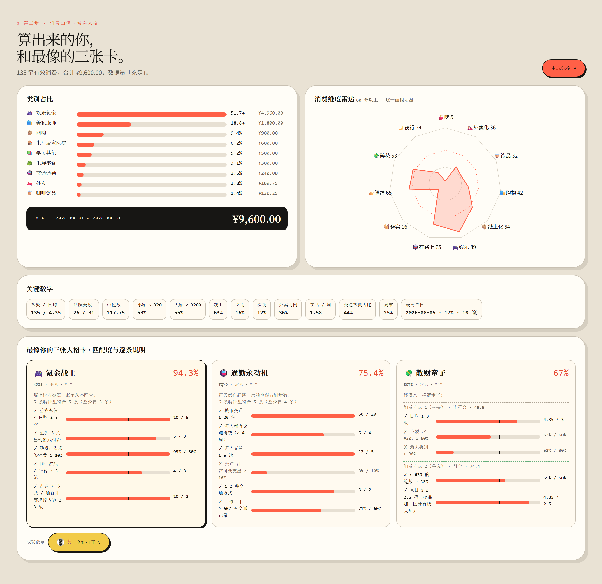
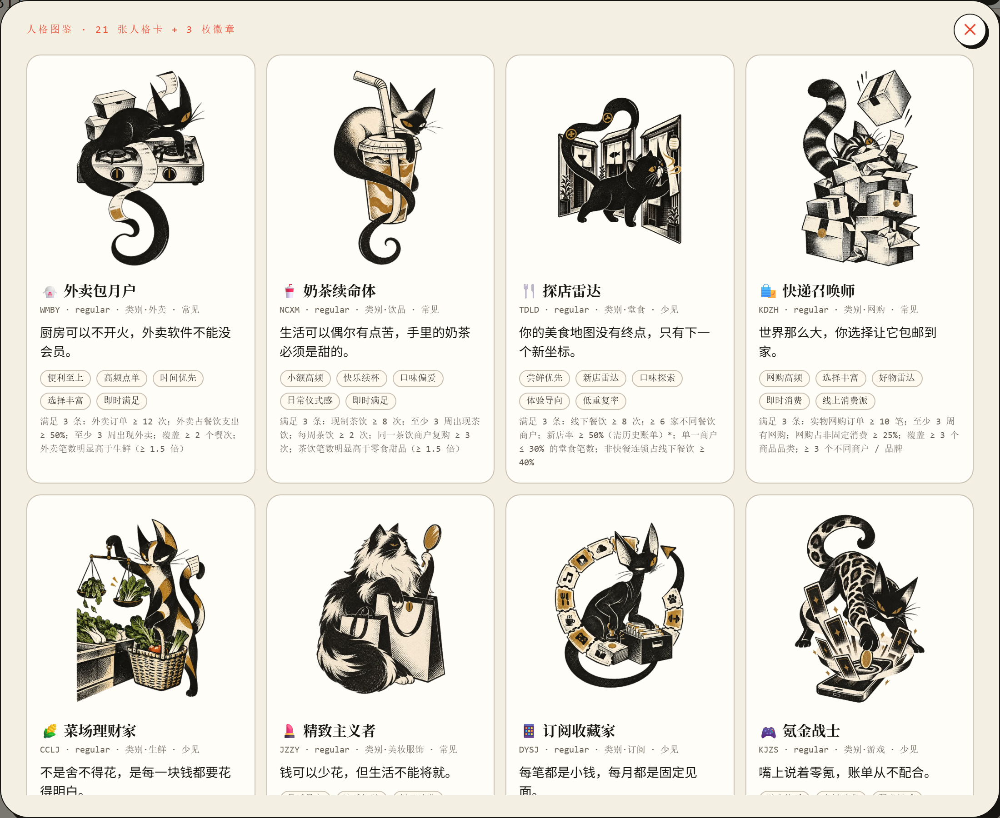

<div align="center">


# MoneyBTI 钱格

**本月的钱，花成了什么样？**

把一份月账单，变成读得懂的消费人格与值得收藏的钱格小票。

[在线体验](https://zhao1201-moneybti.hf.space) · [Hugging Face Space](https://huggingface.co/spaces/Zhao1201/MoneyBTI) · [快速开始](#快速开始)

</div>

MoneyBTI 是一款 AI 消费人格分析应用。导入支付宝或微信账单，确认交易分类，就能发现自己的花钱风格：了解消费习惯、探索专属猫咪人格，再把这份月度记忆保存为复古小票。

[](assets/preview-upload.png)

## 核心功能

| 功能 | 你可以做什么 |
| --- | --- |
| 账单导入 | 上传或拖入支付宝、微信导出的 CSV / XLSX 账单，跟随内置教程完成导出，也可直接使用演示账单体验。 |
| 分类确认 | 自动整理消费类别，筛选需要确认的交易，并在生成结果前手动修正分类。 |
| 消费画像 | 通过类别分布、消费雷达和候选人格，了解自己的花钱偏好与匹配依据。 |
| 专属钱格 | 获得猫咪人格卡、个性解读、消费特征和成就徽章，让账单变成一份有趣的月度观察。 |
| 小票分享 | 切换奶油、夜市、薄荷主题，导出 PNG 图片，或复制分享文案。 |
| 人格图鉴 | 浏览不同钱格的插画、性格描述与特点，探索自己之外的花钱风格。 |
| 双语体验 | 在中文与英文界面之间切换，查看对应语言的人格解读与小票。 |

### 从消费习惯，认识你的钱格

每张人格卡都有对应的消费特征与匹配说明。结果页将人格解读与复古小票放在一起，方便回顾、收藏和分享。

[](assets/preview-result.png)

### 最终生成效果 · 人格小票

生成完成后，展开小票即可查看完整的猫咪人格插画、匹配度、成就徽章、消费特征与专属解读。下面展示奶油主题的完整小票，可直接导出为 PNG 保存或分享。

<p align="center">
  <a href="assets/preview-ticket.png"></a>
</p>

<p align="center"><sub>合成演示账单生成效果 · 点击查看完整高清小票</sub></p>

### 看见花钱偏好，也看懂匹配依据

类别分布与消费雷达帮助你快速理解账单；候选人格附带匹配说明，让结果有迹可循。生成之前，可以返回分类表调整交易类别。

[](assets/preview-metrics.png)

### 探索钱格猫的人格图鉴

从日常消费习惯到鲜明的生活偏好，每一种钱格都有自己的猫咪形象、人格描述与风格标签。

[](assets/preview-gallery.png)

<sub>以上为当前界面与合成演示账单的功能预览，采用 2 倍像素密度截图；点击图片可查看高清原图。</sub>

## 如何使用

1. **导入账单**：打开应用，上传支付宝 / 微信账单，或选择内置演示账单。
2. **确认分类**：检查自动分类结果，修正未分类或存在歧义的交易。
3. **查看画像**：浏览消费偏好、候选人格和匹配说明。
4. **生成与分享**：生成专属钱格，选择小票主题，保存图片或复制文案。

应用提供两种分析模式，也支持并排对比结果：

| 模式 | 功能 |
| --- | --- |
| 普通版 | 通过商户规则整理交易，生成人格解读与分享小票。 |
| VIP 版 | 在规则分类基础上加入 AI 逐笔语义分析，并支持副人格与消费亮点。 |

## 快速开始

### 本地运行

使用 Python 3.11，在项目根目录执行：

```bash
python -m venv .venv
```

激活虚拟环境并配置 OpenRouter API Key。

**Windows PowerShell**

```powershell
.\.venv\Scripts\Activate.ps1
$env:OPENROUTER_API_KEY = "你的 API Key"
```

**macOS / Linux**

```bash
source .venv/bin/activate
export OPENROUTER_API_KEY="你的 API Key"
```

安装依赖并启动：

```bash
python -m pip install -r requirements.txt
python -m uvicorn api.main:app --reload --port 7860
```

访问 [本地应用](http://localhost:7860)，或打开 [API 文档](http://localhost:7860/docs)。普通版的账单解析、分类与消费画像可在未配置 Key 时使用；AI 人格文案生成和 VIP 逐笔分析需要配置模型服务。

### Docker 部署

```bash
docker build -t moneybti .
docker run --rm -p 7860:7860 -e OPENROUTER_API_KEY moneybti
```

运行前需在当前终端设置 `OPENROUTER_API_KEY`，容器会读取该环境变量。

<details>
<summary>模型服务配置</summary>

默认使用 OpenRouter，也支持通过环境变量配置阿里云百炼或其他 OpenAI 兼容接口。

| 环境变量 | 用途 |
| --- | --- |
| `OPENROUTER_API_KEY` | OpenRouter API Key。 |
| `MONEYBTI_PROVIDER` | 服务提供商：`openrouter`（默认）或 `bailian`。 |
| `DASHSCOPE_API_KEY` | 使用百炼时的 API Key。 |
| `MONEYBTI_BASE_URL` | 自定义兼容接口地址；使用百炼时请填写所用服务的实际地址。 |
| `MONEYBTI_MODEL` | 统一指定模型。 |
| `MONEYBTI_MODEL_M3` / `MONEYBTI_MODEL_M6` / `MONEYBTI_MODEL_M7` | 分别指定逐笔分类、人格文案和语气复核模型，优先于统一配置。 |

具体默认值与配置逻辑见 [`core/llm.py`](core/llm.py)。

</details>

## 工作原理

账单解析 → 自动分类 → 用户确认 → 消费画像与人格匹配 → AI 解读 → 小票渲染。

账单清洗、指标计算和候选人格匹配由代码与规则完成，AI 根据已有结果生成解读。生成文案还会经过数字与表达检查；未通过复核时，可回退至预设文案。

**技术栈**：FastAPI · Pandas / OpenPyXL · OpenAI SDK · 原生 JavaScript / CSS · Docker。

```text
api/       HTTP 接口与静态页面服务
core/      账单解析、分类、画像计算与 AI 工作流
rag/       人格知识库与商户分类规则
web/       交互界面、人格图鉴与小票渲染
assets/    项目预览图片
tests/     合成演示账单与测试用例
eval/      评估脚本与开发验证工具
```

## 数据处理与使用说明

- 上传的原始账单文件在解析后删除，分析会话保存在服务端内存中。
- 姓名、账号、订单号不会作为交易字段读入；使用 AI 功能时，所需的交易描述或汇总特征会发送至配置的模型服务。模型调用会在服务端 `cache/` 目录缓存。
- 钱格用于消费习惯观察与娱乐分享，匹配度表示规则贴合程度，不代表心理测评结果，也不构成财务建议。

<sub>项目起源于 NTU PE6203 · Generative AI & Agentic AI 课程。</sub>
